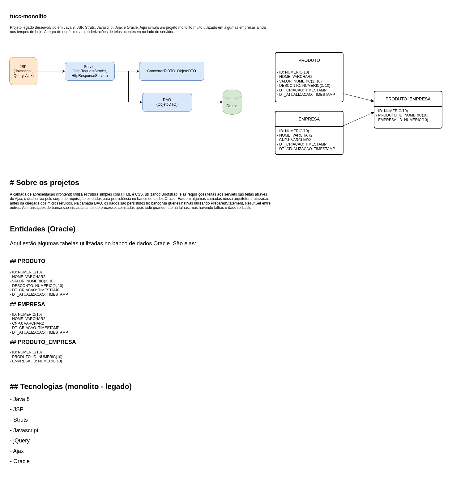

# tucc-monolito

Aplicação legada Java 8 com **Struts 2** e **JSP** que realiza o CRUD no banco **Oracle**. É a **única fonte de escrita** no Oracle — os microsserviços nunca escrevem diretamente nele.



## Como funciona

Cada entidade tem uma tríade Action / DAO / JSP:

- **Action** (Struts 2) — recebe a requisição, chama o DAO e redireciona para a view
- **DAO** (JDBC puro + Apache DBCP) — executa as queries no Oracle
- **JSP** — renderiza os formulários e listagens

## Telas disponíveis

| Path | Descrição |
|------|-----------|
| `/produto/listar.action` | Listagem de produtos |
| `/produto/novo.action` | Cadastro de produto |
| `/produto/salvar.action` | Salvar / atualizar produto |
| `/empresa/listar.action` | Listagem de empresas |
| `/empresa/novo.action` | Cadastro de empresa |
| `/empresa/salvar.action` | Salvar / atualizar empresa |
| `/produtoEmpresa/listar.action` | Listagem de associações |
| `/produtoEmpresa/novo.action` | Associar produto a empresa |

## Variáveis de ambiente

| Variável | Descrição |
|----------|-----------|
| `ORACLE_HOST` | Host do Oracle |
| `ORACLE_PORT` | Porta (padrão: 1521) |
| `ORACLE_DB` | Nome do PDB (padrão: `XEPDB1`) |
| `ORACLE_USER` | Usuário Oracle |
| `ORACLE_PASSWORD` | Senha Oracle |

## Build e execução

```bash
mvn clean package          # gera tucc-monolito.war
mvn tomcat7:run            # sobe em http://localhost:8090
```
