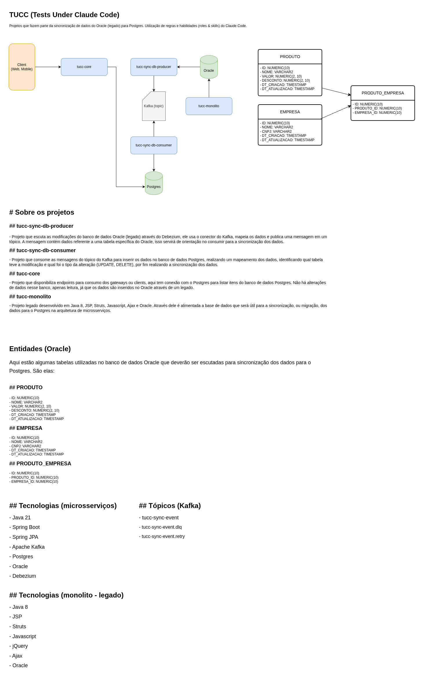

# tucc-sync-db-producer

Microsserviço responsável por capturar alterações no banco Oracle via **Debezium CDC** (Change Data Capture) e publicar os eventos no **Apache Kafka**.



## Como funciona

1. O **Debezium Engine** (embutido, sem Kafka Connect externo) conecta-se ao Oracle via LogMiner e monitora as tabelas `PRODUTO`, `EMPRESA` e `PRODUTO_EMPRESA`.
2. A cada alteração detectada (`INSERT`, `UPDATE`, `DELETE`), o **`DebeziumEventHandler`** recebe o evento em lote.
3. O **`DebeziumEventMapper`** transforma o envelope JSON do Debezium em um `SyncEventPayload`.
4. O payload é publicado no tópico Kafka `tucc-sync-event`.

## Variáveis de ambiente

| Variável | Descrição |
|----------|-----------|
| `KAFKA_BOOTSTRAP_SERVERS` | Endereço do broker Kafka |
| `ORACLE_HOST` | Host do Oracle |
| `ORACLE_PORT` | Porta do Oracle (padrão: 1521) |
| `ORACLE_DBNAME` | Nome do CDB (ex: `XE`) |
| `ORACLE_PDB` | Nome do PDB (ex: `XEPDB1`) |
| `ORACLE_USER` | Usuário com permissão de LogMiner |
| `ORACLE_PASSWORD` | Senha do usuário Oracle |
| `ORACLE_SCHEMA` | Schema a monitorar (ex: `TUCC`) |

## Build e execução

```bash
./mvnw clean package
./mvnw spring-boot:run
```

## Tópicos Kafka produzidos

| Tópico | Conteúdo |
|--------|----------|
| `tucc-sync-event` | Eventos CDC normalizados (`table`, `operation`, `before`, `after`, `capturedAt`) |

## Requisitos do Oracle

O Oracle deve estar com **ARCHIVELOG** ativado e **supplemental logging** habilitado para as tabelas monitoradas.
